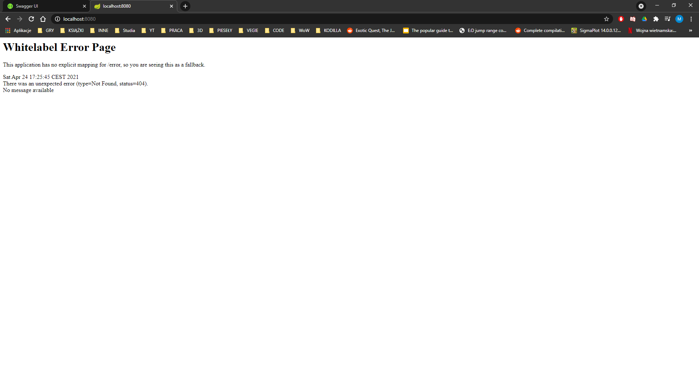
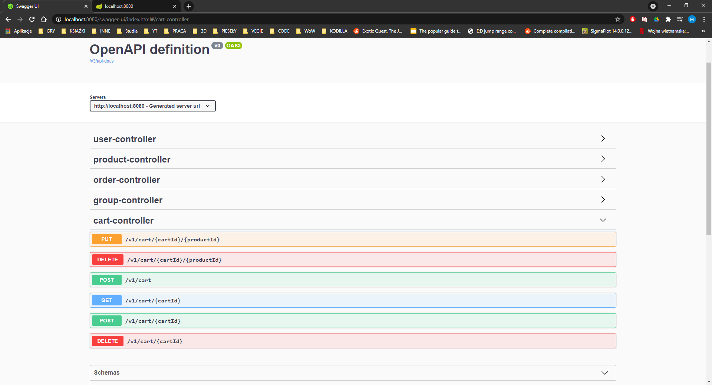
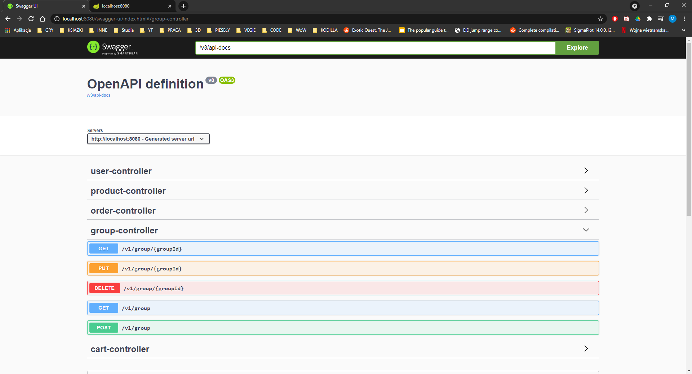
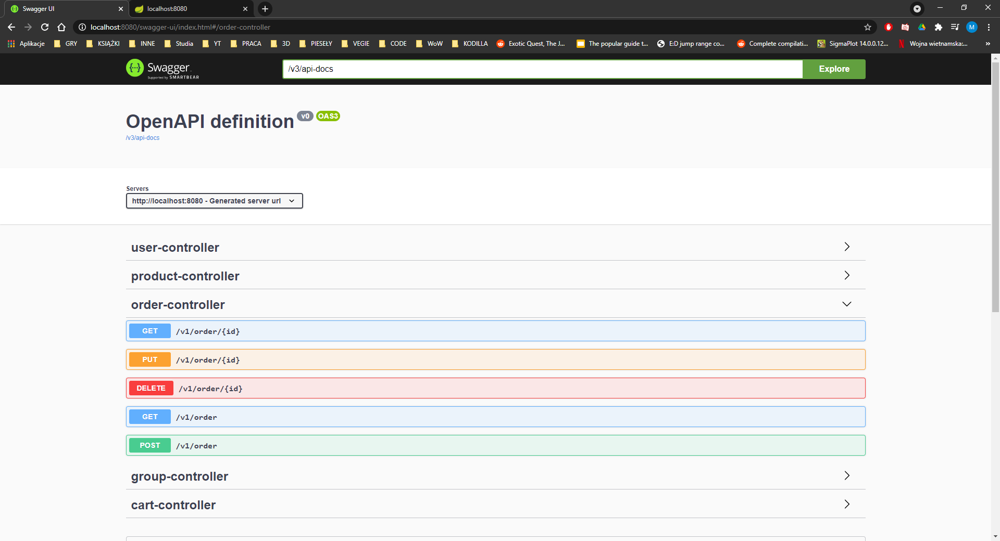
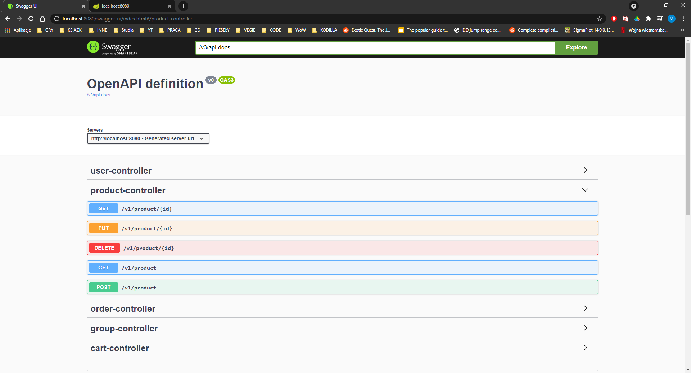
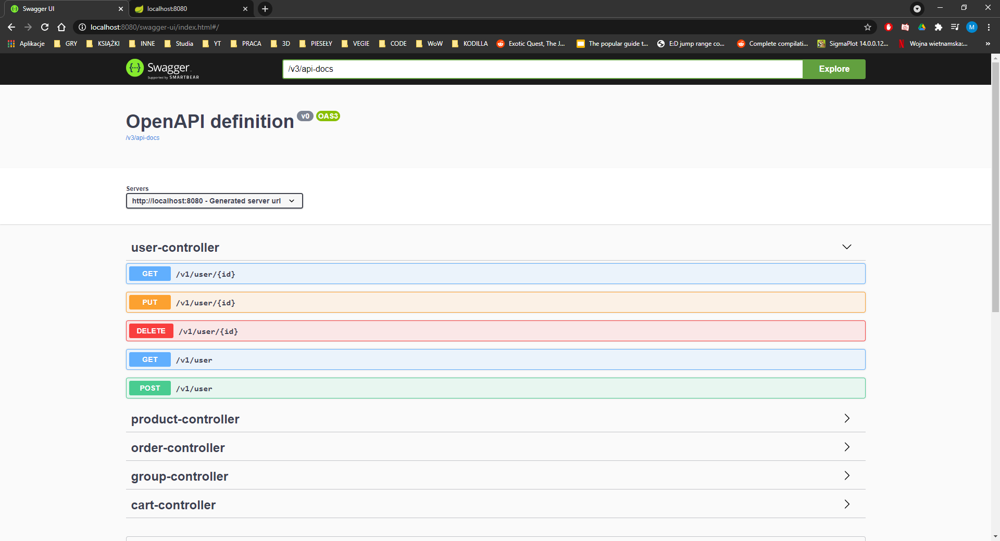

# 1. Description

This project is a group exercise including implementation of a simple back-end logic for an ecommerce store.
In project You can find 5 entities (user, order, cart, product, group) that uses SQL relationships.
All project is build according to REST architecture.

# 2. Demo

Project is only available at this repository at this moment.

# 3. Requirements

- Java 8
- Spring Boot 2.1.1
- MySQL 8
- Gradle 4.10
- Lombok 1.18
- Junit 5.4
- SpringDoc 1.5

# 4. Startup

Project can be launched locally by executing EcommerceeApplication class, which starts up the Spring ApplicationContext.
While on it can be accesed via [local address](http://localhost:8080).

# 5. Endpoints description

Endpoint documentation is available on a webpage, generated by project on this [URL](http://localhost:8080/swagger-ui/index.html).
If You opened something else with swagger You need to change value in box to: /v3/api-docs

|  |  |
:---:|:---:
 | 
 | 
 |

# 6. Application

At this stage, project can operate with simple operations like:
- create User and Cart for user,
- Product will be deleted when Group is deleted, but when Product is deleted Group stays,
- Order is based on a created Cart,
- can deactivate User,

Future development:
- more appropriate business logic,
- add payment methods and announcers (mailing system etc.),
- security features,

# 7. Troubleshooting

To be added